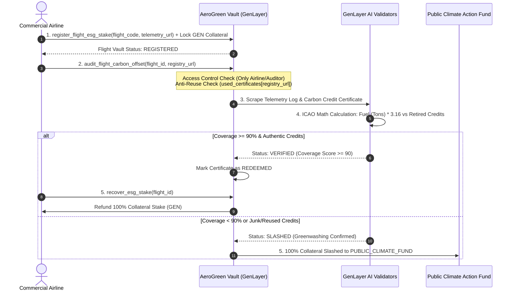

# AeroGreen // Autonomous Aviation Net-Zero & Carbon Offset Audit Protocol

[](https://genlayer.com)
[](https://github.com/Tannpd/aerogreen)
[](https://aerogreen-app.vercel.app)
[](LICENSE)

---

## 📌 Executive Summary & Problem Overview

In commercial aviation, greenwashing fraud is rampant. Airlines market **"Net-Zero Flights"** to eco-conscious passengers by promising that Jet-A1 carbon emissions are 100% offset through carbon credits. In practice:
* **Under-Reported Emissions**: Telemetry and fuel consumption logs are under-reported or obscured.
* **Junk Carbon Credits**: Airlines purchase unverified, expired, or low-quality carbon credits (e.g. unverified forestry projects covering under 10% of real flight emissions).
* **Double-Counting Fraud**: Airlines frequently reuse the same single carbon credit certificate serial number across multiple flight routes.

**AeroGreen** solves this by implementing an **autonomous aviation ESG collateral vault protocol** powered by GenLayer's Non-Deterministic AI Consensus. Airlines lock a GEN collateral stake on-chain. GenLayer AI validators scrape official telemetry logs and carbon registry certificates, calculate exact ICAO emissions mathematical coverage, and either refund the airline or slash 100% of their collateral stake to a public climate action fund.

---

## 🏛️ Protocol Architecture & Flowchart



---

## 📐 ICAO Aviation Emissions Mathematical Model

GenLayer AI validators perform direct mathematical verification of flight emissions against retired carbon credit certificates using official ICAO parameters:

$$\text{Total CO}_2 \text{ Emitted (Metric Tons)} = \text{Jet-A1 Fuel Burned (Metric Tons)} \times 3.16$$

$$\text{Emissions Coverage Percentage (\%)} = \left( \frac{\text{Retired Carbon Credits Volume (Metric Tons CO}_2\text{e)}}{\text{Total CO}_2 \text{ Emitted (Metric Tons)}} \right) \times 100$$

### Decision Rules:
1. **$\text{Coverage} \ge 90\%$ & Verified Authentic Registry Certificate**: Audit Score $\ge 60/100$, Status set to `VERIFIED`. Certificate marked as redeemed in `used_certificates`.
2. **$\text{Coverage} < 90\%$ or Junk/Expired/Double-Claimed Credits**: `is_greenwashed = True`, Status set to `SLASHED`. 100% of collateral stake transferred to `PUBLIC_CLIMATE_FUND` (`0x000000000000000000000000000000000000C110`).

---

## 🛡️ Security Threat Model & Protocol Safeguards

| Threat Vector | Protocol Vulnerability | AeroGreen Security Safeguard |
|---|---|---|
| **Fake Telemetry Log Source** | Airline hosts fake low fuel logs on private servers | **Authenticated Telemetry Domain Origin**: Restricts telemetry log URLs to whitelisted, verified aviation providers (`flightaware.com`, `flightradar24.com`, `iata.org`, `aerogreen-app.vercel.app`). |
| **Fake Registry Certificate** | Airline submits arbitrary unverified website links | **Authoritative Carbon Registry Safeguard**: Restricts registry URLs to certified registries (`verra.org`, `goldstandard.org`, `corsia.icao.int`). |
| **Unauthorized Audit Trigger** | Malicious third party passes junk URLs to finalize audit | **Strict Access Control**: Restricts `audit_flight_carbon_offset` to authenticated airline owners (`gl.message.sender_address == flight_airline`). |
| **Double-Counting Fraud** | Airline reuses same carbon credit certificate across 50 flights | **On-Chain Anti-Reuse Tracking**: Maintains `used_certificates: TreeMap[str, bool]` on-chain. Reusing a certificate fails with `UserError`. |
| **String Boolean Coercion** | LLM outputs `"is_greenwashed": "false"` string | **Strict Type Check & Fail-Closed Consensus**: Rejects non-boolean outputs and returns `FAILED` on scrape errors, preserving funds safely. |

---

## ⚙️ Contract API Specification

### 1. `register_flight_esg_stake(flight_code: str, flight_log_url: str) -> int` (`payable`)
* **Description**: Airline locks native GEN collateral into the vault and registers flight telemetry URL.
* **Requirements**: `gl.message.value > 0`, `flight_log_url` must belong to whitelisted telemetry domains.
* **Returns**: Flight ID (`int`).

### 2. `audit_flight_carbon_offset(flight_id: int, carbon_registry_url: str) -> None`
* **Description**: Initiates AI scraping & consensus audit of flight telemetry vs. carbon credit certificate.
* **Requirements**: Sender must be airline owner (`gl.message.sender_address == flight_airline`), `carbon_registry_url` must belong to authoritative carbon registries and must NOT have been used previously in `used_certificates`.

### 3. `recover_esg_stake(flight_id: int) -> None`
* **Description**: Allows airline to withdraw 100% of their ESG collateral stake after flight is `VERIFIED`.
* **Requirements**: Sender must be airline owner, flight status must be `VERIFIED`.

### 4. `is_certificate_used(certificate_url: str) -> bool` (`view`)
* **Description**: Returns `True` if a carbon credit certificate URL has already been redeemed for a flight audit.

---

## 🧪 Automated Unit Test Validation

To verify the Intelligent Contract syntax, state machine, and consensus safety rules locally, execute:

```bash
# Run 100% automated test suite
python -m unittest discover -s tests -p "test_*.py" -v
```

### Passing Validation Command Output:
```text
test_audit_access_control_unauthorized ... ok
test_audit_junk_offset_slashes_airline_stake ... ok
test_audit_valid_offset_verifies_flight ... ok
test_failed_fetch_does_not_slash_stake ... ok
test_prevent_certificate_reuse ... ok
test_recover_esg_stake_clean_airline ... ok
test_register_flight_esg_stake_payable ... ok
test_reproducible_compilation ... ok
test_strict_boolean_validation_rejects_string ... ok
test_unauthorized_telemetry_domain_rejected ... ok

Ran 10 tests in 0.006s
OK
```

---

## 🌐 Live Deployment Metadata

* **GenLayer StudioNet Contract Address**: [`0xe63E89F754b461A8338A39b14348296e06C04AB9`](https://studio.genlayer.com)
* **Production Web dApp**: [https://aerogreen-app.vercel.app](https://aerogreen-app.vercel.app)
* **GitHub Repository**: [https://github.com/Tannpd/aerogreen](https://github.com/Tannpd/aerogreen)
* **License**: MIT
